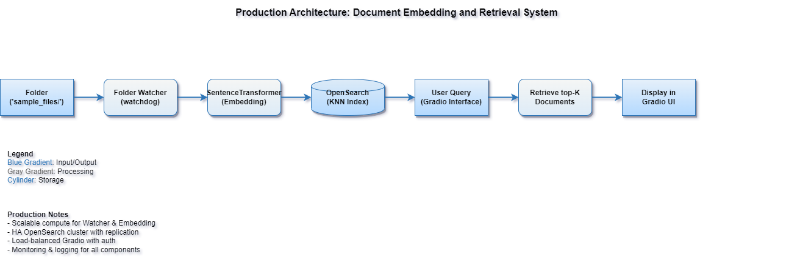

# Real-Time RAG Pipeline with OpenSearch and Gradio


## Overview

This project builds a **real-time Retrieval Augmented Generation (RAG)** pipeline by:
- Watching a folder for file creations, updates, and deletions.
- Auto-indexing documents into an **OpenSearch vector index** with **embeddings**.
- Querying via a **Gradio UI** where users ask questions and retrieve top-matching documents.

Inspired by real-world observability and GenAI use cases!

---

## Features

- **Real-Time File Monitoring**: Automatically detect new/updated/deleted files.
- **Automatic Embedding**: Use Sentence-Transformer to generate vector embeddings.
- **OpenSearch Vector Search**: Store and search document embeddings.
- **Simple Gradio UI**: Query documents naturally using LLM-augmented search.
- **LightWeight LLM Model**: Custom fine-tuned qwen2.5-coder1.5b quantized to 8bit to run on systems without GPU's and still provide a reasonable response time.

---

## Architecture Diagram



---

## Tech Stack

- Python 3.10+
- [OpenSearch](https://opensearch.org/) (Vector KNN Index)
- [Sentence-Transformers](https://www.sbert.net/)
- [Gradio](https://gradio.app/)
- [Watchdog](https://python-watchdog.readthedocs.io/en/stable/)
- [LLM Model](https://huggingface.co/kshitijthakkar/qwen2_5-Coder-1_5b-loggenix-2k_merged)
---
## Use Cases:
- Knowledge bases.

- Real-time document monitoring.

- AI-assisted search apps
---
## Quickstart

### 1. Clone Repository

```bash
git clone https://github.com/Mandark-droid/rag-workflow-opensearch.git 
cd realtime-rag-pipeline-opensearch
pip install -r requirements.txt
# Start OpenSearch locally (via Docker):
docker run -p 9200:9200 -e "discovery.type=single-node" opensearchproject/opensearch:latest

python watcher.py      # start folder watcher
# Add/Update/Delete files in watched_folder to have them auto-indexed and query on them in the next step through the UI
python gradio_app.py   # launch UI
